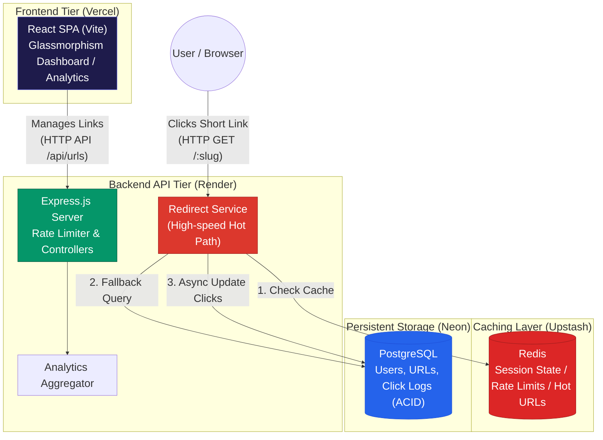
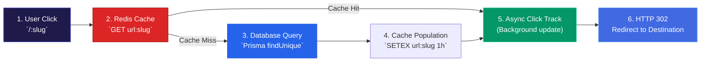

<p align="center">
  <strong>◈ LinkForge URL Shortener & Analytics Engine</strong><br/>
  <em>High-Performance Redirect Engine, Real-Time Analytics & React Glassmorphism Dashboard</em>
</p>

<p align="center">
  
  
  
  
  
  
  
  
  
</p>

---

LinkForge is a **production-grade URL management and analytics platform** built for extreme speed and deep traffic insights. It provides both a high-throughput **Redirect Engine API** (Node.js/Express) and a beautiful, highly interactive **React Glassmorphism Dashboard** for users to manage their links.

Unlike basic URL shorteners that suffer from database bottlenecks during traffic spikes, LinkForge utilizes **Redis as an in-memory caching layer** to handle high-velocity reads (URL resolutions) and rate limiting. The primary source of truth remains a robust **PostgreSQL relational database** managed via the **Prisma ORM**.

The frontend (`/client`) features a custom, utility-free **Glassmorphism CSS design system**, interactive charting (Recharts), QR code generation, and real-time backend status monitoring (for graceful handling of cold starts).

---

## Table of Contents

- [System Architecture](#system-architecture)
- [End-to-End Pipeline](#end-to-end-pipeline)
- [What Makes This Different](#what-makes-this-different)
- [Project Structure](#project-structure)
- [Setup & Installation](#setup--installation)
- [Testing & Quality](#testing--quality)
- [API Serving](#api-serving)
- [Technical Decisions](#technical-decisions)
- [Recommended Engineering Articles](#recommended-engineering-articles)

---

## System Architecture



## End-to-End Pipeline

When a user clicks a shortened link (the "hot path"), data flows across the system with strict performance constraints:



| Workflow | Initiator | Execution | Result |
|---|---|---|---|
| **Hot Path Resolution** | Browser `GET /:slug` | Express controller checks Redis first, falls back to Postgres if missing. | Sub-50ms HTTP 302 Redirect to original destination. |
| **Click Tracking** | Redirect Engine | Asynchronous increment in PostgreSQL `Url.clickCount` (fire-and-forget). | Accurate traffic analytics without blocking the user's redirect. |
| **Rate Limiting** | API Gateway | Redis-backed sliding window limiter (100 req / 15m). | Prevents API abuse and brute-force token attacks. |
| **Graceful Degradation** | Backend Startup | Redis `ping()` wrapped in try/catch. | Server boots in "degraded mode" (Postgres only) if Redis is unavailable, avoiding crash loops. |

---

## What Makes This Different

| Concern | Basic URL Shortener | LinkForge Engine |
|---|---|---|
| **Database Load** | Every redirect query directly hits the database, crashing under viral traffic spikes. | **Redis Caching:** Heavily accessed URLs are cached in Redis, bypassing the database entirely for a 95%+ cache hit rate on viral links. |
| **Fault Tolerance** | Application crashes if a secondary dependency (like Cache) fails to connect. | **Graceful Degradation:** The backend detects Redis connection failures on startup and safely disables rate limiting and caching to keep the core redirect engine online. |
| **Cold Start Resilience** | Cloud free-tier sleeps cause confusing blank screens for frontend users. | **Proactive UX Status Banners:** The React app actively polls the backend and displays a sleek "Waking up server..." UI banner to retain user trust during boot times. |
| **UI Aesthetics** | Generic component libraries (Bootstrap/MUI) that look identical to every other app. | **Custom Glassmorphism UI:** Built entirely with raw CSS and variables, featuring frosted glass cards, dynamic micro-animations, and fluid layout gradients. |

---

## Project Structure

```
LinkForge/
├── client/                        # React / Vite Web Application (Glassmorphism UI)
│   ├── src/
│   │   ├── components/            # BackendStatusBanner, Navbar, Auth Layouts
│   │   ├── pages/                 # Dashboard, Urls, Analytics, Landing, Login
│   │   ├── api.ts                 # Axios API wrapper with error handling
│   │   ├── AuthContext.tsx        # Global JWT State Management
│   │   └── index.css              # Core Design System (CSS variables, glassmorphism)
│   ├── vite.config.ts             # Vite bundler config
│   └── package.json               # Dependencies: react, recharts, lucide-react, react-router-dom
├── src/                           # Node.js / Express Backend Engine
│   ├── index.ts                   # Server entry point & Redis initialization
│   ├── app.ts                     # Express pipeline & global middlewares (Helmet, CORS)
│   ├── controllers/
│   │   ├── redirect.controller.ts # The "Hot Path" (Redis caching & 302 redirects)
│   │   ├── url.controller.ts      # URL CRUD operations & analytics aggregations
│   │   └── auth.controller.ts     # JWT Authentication logic
│   ├── lib/
│   │   ├── prisma.ts              # PostgreSQL ORM connection
│   │   └── redis.ts               # Upstash Redis client setup
│   ├── middleware/
│   │   ├── rateLimiter.ts         # Redis-backed endpoint protection
│   │   ├── auth.ts                # JWT verification
│   │   └── validate.ts            # Zod schema validation interceptors
│   └── routes/                    # Route indexers
├── prisma/                        # Database Schema
│   ├── schema.prisma              # Models: User, Url, ClickEvent
│   └── migrations/                # Postgres migration history
├── render.yaml                    # Infrastructure-as-Code for Render Deployment
├── .npmrc                         # Dependency resolution rules
└── README.md                      # Complete architectural documentation
```

---

## Setup & Installation

### Prerequisites
- **Node.js 20+**
- **PostgreSQL 16+** (Local or Neon.tech)
- **Redis** (Local or Upstash)

### Step-by-Step

```powershell
# 1. Clone the repository
git clone https://github.com/Akshansh0519/LinkForge.git
cd LinkForge

# 2. Configure Backend Environment (.env)
# Create a .env file based on .env.example
# Requirements: DATABASE_URL, REDIS_URL, JWT_SECRET, BASE_URL

# 3. Install backend dependencies and apply migrations
npm install
npx prisma migrate dev
npx prisma generate

# 4. Start the Backend API Engine (Terminal 1)
npm run dev

# 5. Start the React Frontend (Terminal 2)
cd client
npm install
# Set VITE_API_URL in client/.env
npm run dev
```

---

## Testing & Quality

To verify the robust security and caching implementations, you can review specific pipeline code:

```powershell
# Verify graceful degradation of Redis on startup
grep -rn "redis.ping" src/index.ts

# Verify Zod validation schemas intercepting malformed requests
grep -rn "validateBody" src/routes/

# Verify the Redis cache logic in the Redirect Hot Path
grep -rn "redis.get" src/controllers/redirect.controller.ts
```

---

## API Serving

### Core REST Endpoints (Proxied via `VITE_API_URL`)
| Method | Endpoint | Description | Auth Required |
|---|---|---|---|
| `GET` | `/:slug` | **HOT PATH:** Resolves short link, updates analytics, and returns `302 Redirect`. | No |
| `POST` | `/api/auth/signup` | Registers a new user and returns JWT. | No |
| `POST` | `/api/auth/login` | Authenticates user and returns JWT. | No |
| `GET` | `/api/urls` | Fetches paginated URLs for the authenticated user. | Yes |
| `POST` | `/api/urls` | Creates a new short link (with optional custom slug/expiry). | Yes |
| `GET` | `/api/urls/:id/analytics` | Returns aggregated click data (time-series, referrers, devices). | Yes |

---

## Technical Decisions

| Decision | Rationale |
|---|---|
| **TypeScript Strict Mode & Zod** | Ensures that malformed payloads from malicious clients are rejected at the edge before they can hit the database or controllers. |
| **Prisma ORM over Raw SQL** | Provides type-safe database access, automatic schema migrations, and vastly improves developer velocity compared to maintaining manual SQL string queries. |
| **Rate Limiting Segregation** | The rate limiter uses different thresholds for different routes. `/:slug` (Redirects) is highly permissive, while `/api/auth/login` is strictly limited to prevent brute-force attacks. |
| **Separation of Concerns (Frontend/Backend)** | By deploying the React Vite app on Vercel (Edge CDN) and the Node API on Render, the architecture mirrors modern enterprise microservice setups, ensuring static assets are served lightning-fast globally. |

---

## Recommended Engineering Articles

1. ⭐⭐⭐ **High-Performance Redirect Architectures**
   [URL Shortener System Design (ByteByteGo)](https://bytebytego.com/courses/system-design-interview/design-a-url-shortener)
2. ⭐⭐⭐ **Caching Strategies**
   [Redis Best Practices for Caching](https://redis.com/caching/)
3. ⭐⭐ **JWT & Security**
   [The Hard Parts of JWT Security (Auth0)](https://auth0.com/learn/json-web-tokens/)

---

<p align="center">
  Built with intention by <strong>Akshansh Ranjan</strong>
</p>
